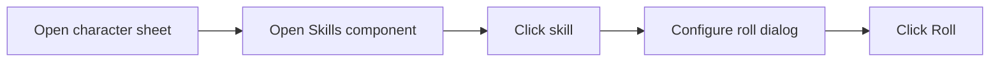
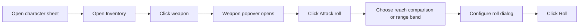
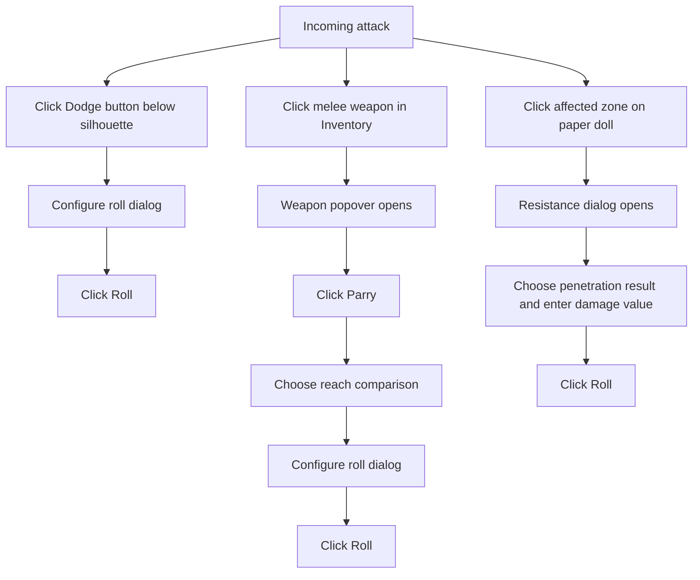

# Player click workflows

This document shows where a player starts each workflow and which UI elements
they click. The workflows are independent; Foundry does not automatically pass
an attack from one participant to the next.

## Entry points

| Workflow | Entry point |
|---|---|
| Skill roll | Character sheet → Skills component → skill |
| Attack | Character sheet → Inventory → weapon |
| Dodge | Character sheet → Paper doll → compact **Dodge** button below the silhouette |
| Parry | Character sheet → Inventory → melee weapon |
| Resistance | Character sheet → Paper doll → affected body zone |

## Roll a skill

## Attack an opponent

## Defend against an opponent

An incoming attack can lead to three separate click workflows.

The paper-doll card contains two distinct entry points. Its compact icon/value
button directly below the silhouette starts **Dodge**. Clicking a body zone on
the silhouette or the resistance icon in that zone's armour row starts
**Resistance** for that specific location. Parry remains on the relevant melee
weapon.
