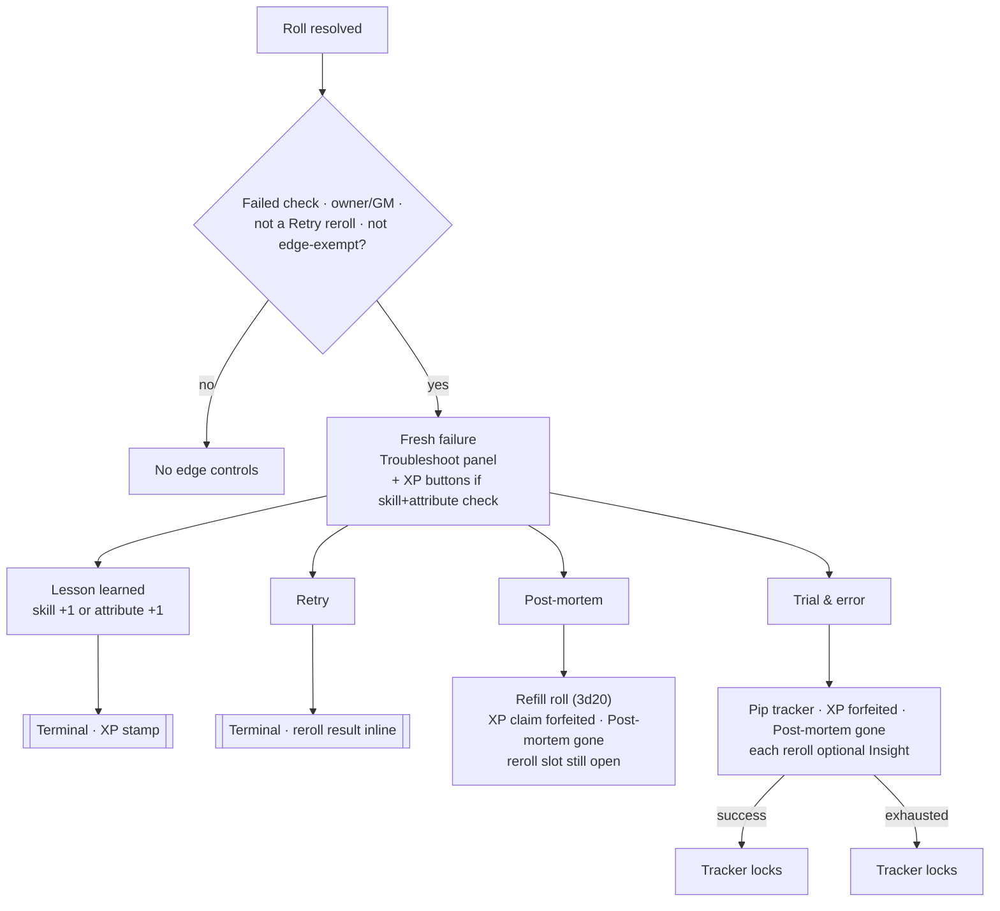

# Edge Pool - Product Requirements Document

**Version:** 2.3
**Last Updated:** 2026-07-25
**Status:** Implementation Complete — open for iteration

---

## Table of Contents

1. [Overview](#overview)
2. [Naming](#naming)
3. [The Edge Pool](#the-edge-pool)
4. [Failed-roll card layout](#failed-roll-card-layout)
5. [Decision tree & eligibility](#decision-tree--eligibility)
6. [Actions](#actions)
7. [Implementation Notes](#implementation-notes)
8. [Localization](#localization)
9. [Open Questions / Variants to Explore](#open-questions--variants-to-explore)

---

## Overview

The Edge Pool (German UI: "Edge-Pool") is an edge-mechanic pool that lets a character bend the outcome of a check — at the cost of a shared, limited resource. It sits on top of the standard [Tno dice roll](dice-system-prd.md) and does not replace it.

The player-facing mechanics use English names ("edge" being the established TTRPG genre term); the German UI translates each name rather than reverting to the older German labels. The **persisted** data keys keep their original names for zero-migration compatibility — see [Naming](#naming) and [Implementation Notes](#implementation-notes).

---

## Naming

As of v2.0 the mechanics were renamed. In-memory code identifiers and derived-value keys were renamed with them; persisted keys (actor `system.problemSolving.spent`, message `flags.tno.edge.*`) were **not**, so existing actors and old chat cards keep working without migration.

| Mechanic | English (en.json) | German (de.json) | Derived / code id | Persisted key (unchanged) |
|---|---|---|---|---|
| Pool (resource) | Edge pool | Edge-Pool | `edgePool` / `edgePoolMax` | `problemSolving.spent` |
| Panel trigger | Troubleshoot ({N}) | Fehlersuche ({N}) | — | — |
| Idee haben (pre-edge) | Insight | Geistesblitz | `insight` | — (folded into roll components) |
| Fehler finden | Trial & error | Trial & error | `trialErrorMax`, `startTrialError`/`rerollTrialError` | `edge.consumed='findFlaw'`, `edge.findFlaw` |
| Neuer Versuch | Retry | Neuer Versuch | `retry` | `edge.consumed='newAttempt'`, `edge.newAttempt`, `replaces` |
| Fehler Analysieren | Post-mortem | Fehleranalyse | `postMortem` | `edge.analyzeFlaw` |
| XP-Anspruch | Lesson learned | Lehrgeld | `claimXp` | `edge.xpClaim` |

### Design Philosophy

- **Scarcity creates weight:** A single shared pool (not per-action charges) forces players to choose which problem is worth solving.
- **Manual application, system-tracked cost:** Most actions here don't roll dice themselves — they hand the player a number to apply by hand to a check they already made, while the system tracks the point spend and posts a chat record.
- **One self-sustaining action:** "Post-mortem" is the outlier — it costs nothing but XP-on-success, and is how the pool refills.
- **Golden path first:** ~80% of failures just bank the consolation XP ("Lesson learned"), so those two claim buttons sit inline on the failed card as one labeled click each; everything else is guided behind a single "Troubleshoot" expander. See [Failed-roll card layout](#failed-roll-card-layout).

---

## The Edge Pool

- **Storage:** `system.problemSolving.spent` — the actor stores *points spent*, not points remaining. (Persisted key kept under its original name; see [Naming](#naming).)
- **Derived values:** `system.derived.edgePool` (current = max − spent) and `system.derived.edgePoolMax`.
- **Manual adjustment:** The edge value is directly editable on the sheet (clamped 0..max). A manual *decrease* is treated as an off-mechanic spend and is announced in chat (`Chat.EdgeSpent`) — an *increase* is not, since it's typically a GM/admin correction.
- **Gate:** The edge-spending actions require `edgePool > 0` before running; otherwise a UI warning (`TNO.Notify.NoReserve`) is shown and nothing happens.

---

## Failed-roll card layout

**Everything an edge action does lives on the roll's own card — no chat announcements, no extra roll cards.** All of Post-mortem, Retry, Trial & error and the XP claim write only to `flags.tno.edge` on the triggering message; the card is re-rendered per viewer off those flags. Post-mortem's 3d20 and Retry's reroll are rolled *in place* (via `rollInPlace` in [dice.mjs](../../module/helpers/dice.mjs), same technique as a Trial-&-error reroll — Dice So Nice fires directly, no `ChatMessage.create`), and their results are stored on `edge.newAttempt.result` / `edge.analyzeFlaw.result` and shown inline. The chat log gains nothing from any edge action (**since v2.2**; the only remaining edge chat message is `Chat.EdgeSpent`, for a manual pool edit on the sheet — which has no roll to attach to).

### What each viewer sees

- **All viewers (read-only):** the inline Retry result block and Post-mortem result block (these replace the standalone cards those rolls used to spawn, so roll outcomes stay public) and the terminal "Lesson learned" stamp.
- **Owner/GM only:** a dimmed **activity summary** (edge spent, XP forfeited, refund, "no time pressure" — derived from flags by `buildSummary`; this is where the GM sees the Trial-&-error time claim they can veto, replacing the old chat notice), the **Trial-&-error tracker** display, and the interactive controls.

### Guided two-view controls (owner/GM)

`renderOwnerPanel` in [chat.mjs](../../module/helpers/chat.mjs) renders a two-view switch (transient per-viewer UI state, a CSS `.troubleshoot` class on the container — never persisted, no re-render, restored across flag-update re-renders):

1. **Main view (default):** the two **"Lesson learned" XP buttons** (`{skill} +1` / `{attribute} +1`, the golden path — one labeled click, an *either/or*; a mis-click banks 1 XP on the wrong field, trivially fixed on the sheet) + a single **Troubleshoot** button.
2. **Troubleshoot view (after clicking Troubleshoot):** the XP buttons are **hidden**; the edge actions appear — **Post-mortem** (until used), the guided **"Try again — is time critical?"** pair (**Trial & error** "No — we have time" / **Retry** "Yes — act now"), and the Trial-&-error reroll control mid-chain — plus a **← Back** button returning to the main view.

The XP buttons show only on a still-clean failure: **any** problem-solving action forfeits the claim, win or lose ([Open Question 6](#open-questions--variants-to-explore) / `xpClaimEligible`), so once you take one, Back returns to a main view carrying just the Troubleshoot toggle. Each control disappears when its own eligibility closes (`buildXpOptions`/`buildEdgeGroups`), so the views are self-pruning.

---

## Decision tree & eligibility

What is still possible after a failed roll — and when it disappears. The rules below are exactly what [chat.mjs](../../module/helpers/chat.mjs) enforces (`renderEdgeSection` gate, `xpClaimEligible`, `buildXpOptions`, `buildEdgeGroups`); this section is the human-readable mirror, not a second source of truth.

**Two hard-terminal states** hide all further controls: **Retry** used (`edge.consumed==='newAttempt'` — the reroll result shows inline as "the result that counts", plus a summary line) and **Lesson learned** claimed (`edge.xpClaim.claimed` — the XP stamp shows). All inline result/summary rendering stays; only the interactive controls end.

**Reroll slot vs Post-mortem:** Post-mortem is only available on a roll no reroll has touched — starting **Trial & error** or a **Retry** (either sets `edge.consumed`) forfeits it. The reverse isn't gated: running Post-mortem first leaves the reroll slot open, so Trial & error / Retry stay available. Trial & error and Retry are mutually exclusive (one reroll chain per roll). **Every problem-solving action forfeits the XP claim** — Post-mortem, Retry, and Trial & error alike, the moment it's taken, win or lose (`xpClaimEligible`).

### Eligibility matrix

| State | Lesson learned | Post-mortem | Trial & error | Retry |
|---|---|---|---|---|
| **Fresh failure** | ✅ †  | ✅ ⚪ᶠ | ✅ | ✅ ⚪ᵉ |
| **Trial & error running** | ✗ forfeited | ✗ ʳ | 🔒 tracker | ✗ slot used |
| **Trial & error succeeded** | ✗ forfeited | ✗ ʳ | 🔒 locked | ✗ slot used |
| **Trial & error exhausted** | ✗ forfeited | ✗ ʳ | 🔒 locked | ✗ slot used |
| **Post-mortem used** (reroll slot free) | ✗ forfeited | ✗ used | ✅ | ✅ ⚪ᵉ |
| **Retry used** | ✗ | ✗ | ✗ | ✗ — terminal; reroll result shown inline |
| **Lesson learned claimed** | ✗ | ✗ | ✗ | ✗ — terminal; XP stamp shown |
| **Controls hidden** (not a failure / not owner / edge-exempt) | ✗ | ✗ | ✗ | ✗ — read-only result blocks may still show to all viewers |

Legend: ✅ shown · 🔒 the reroll's own pip tracker (in progress or locked) · ✗ not rendered · ⚪ᶠ shown but **disabled/greyed when the edge pool is full** (`TNO.Notify.ReserveFull`) · ⚪ᵉ shown but **disabled when the edge pool is empty** · ʳ **forfeited once any reroll (Trial & error or Retry) has touched this roll** (`edge.consumed`) · † Lesson learned needs a skill+attribute check (`skillKey`); ability-/free-mode failures show the Troubleshoot actions but no XP buttons. Rows assume one changed slot at a time — the only combo left is Post-mortem **first**, then a reroll (Post-mortem used **and** Trial & error running: Post-mortem ✗, Trial & error 🔒, Retry ✗, Lesson learned ✗).

---

## Actions

### 1. Insight (formerly Idee haben) - Pre-Edge

- **Cost:** 1 edge point per use.
- **Effect:** Flat `+insight` value, applied by the player on top of the threshold of a check — the intent is to make a hard check reachable ("add your value on top of the original roll's threshold").
- **Mechanically:** No standalone sheet action. Implemented as a checkbox toggle inside [`TnoRollDialog`](../../module/apps/roll-dialog.mjs) ("💡 Insight (+X)"), shown on every roll for `character`-type actors. Toggling it live-updates the threshold preview; submitting the dialog spends the point and rolls in the same step — point spend and roll are computed off the same pre-spend actor state so the just-spent point can't get "un-applied" by its own edge-pool update (see code comment in `_updateObject`). The bonus is folded into the roll's `components` breakdown (label `TNO.Roll.IdeaComponent`), same as an attribute or skill component. The same toggle also exists on every manually-triggered "Trial & error" reroll (see below) — a fully independent choice per reroll, never inherited from the original roll or from an earlier reroll in the same chain.
- **Trigger:** Before a check, or before a manual Trial-&-error reroll. Strictly pre-roll — no retroactive application after the dice have fallen (see Open Question 2 for the rationale). If the edge pool is 0, the checkbox is disabled and greyed out (title shows `TNO.Notify.NoReserve`) — the player sees the option and its unavailability up front, so there's no "I forgot" case to adjudicate.

### 2. Trial & error (formerly Fehler finden) - Post-Edge

- **Cost:** None — a free reroll cap, not a spend.
- **Effect:** Grants up to `trialErrorMax` rerolls of a failed check, stopping at the first success.
- **Mechanically:** Lives on the failed roll's own chat card, not the sheet. Chosen from the guided "Try again — is time critical?" group in the Troubleshoot view (see [Failed-roll card layout](#failed-roll-card-layout)) — it's the "No — we have time" option. Running it opens an empty pip tracker (`○○○` for `trialErrorMax = 3`) and adds a dimmed on-card summary line (`Edge.SummaryTrialError`, "no time pressure assumed · XP forfeited") that the GM can see and veto at the table — **no chat message** (see Open Question 3). No reroll fires automatically: every attempt, including the first, is a manual click on `Nochmal würfeln` (in the Troubleshoot view) with its own optional "Insight" toggle beforehand. Each click rolls the same die count against the same threshold/advantage in place (`rollInPlace`, no new message), appends the attempt, and fills a pip. The tracker locks — reroll control replaced by a done label — on the first success or once all pips are used.
- **Data model:** All state lives in `flags.tno` on the triggering message (`threshold`, `advantage`, `outcome`, `edge.consumed`, `edge.findFlaw.{max,used,active,attempts}` — the persisted `findFlaw` key kept under its original name, see [Naming](#naming)); each attempt optionally carrying `ideaBonus`; the persisted card `content` itself is never rewritten. This keeps the tracker owner/GM-only per viewer and keeps a roll from being "double-spent" by more than one edge action.
- **Trigger:** After a failed check, from that check's own chat card. Free though it is, it's still a problem-solving action, so **starting it forfeits this failure's XP claim** (see [XP-Anspruch](#5-xp-anspruch-lesson-learned---post-failure)), win or lose — `xpClaimEligible` treats any non-null `edge.consumed` as closing the claim.

### 3. Retry (formerly Neuer Versuch) - Post-Edge

- **Cost:** 1 edge point.
- **Effect:** Reroll the failed check exactly once; the second result replaces the first outright, better or worse.
- **Trade-off:** Forfeits the XP the original check would have earned, and forfeits that failure's XP claim outright (see below).
- **Mechanically:** Lives on the failed roll's own chat card as the "Yes — act now" option in the same guided "Try again" group as Trial & error, in the Troubleshoot view. Clicking its run button both selects and executes immediately (opening the Troubleshoot view is itself the deliberate first step, so no separate confirm dialog follows). Choosing `Retry` spends the point and — unlike Trial & error — leaves no further choice to the player: the system rerolls once **in place** (`rollInPlace`, same threshold/advantage as the original, **no new chat message**), stores the result on `edge.newAttempt.result`, and shows it inline on the same card as "the result that counts" (`Roll.NewAttemptCounts`) with a summary line (`Edge.SummaryRetry`). Being a final, superseded result, no further edge actions are offered afterward.
- **Data model:** The replay parameters (`threshold`, `advantage`) live in `flags.tno` on every roll, so `retry` can rebuild an identical reroll via `rollInPlace`. The reroll's outcome is stored on `flags.tno.edge.newAttempt.result` (`{dice, countingValue, outcome, success}`) — the `newAttempt` key kept under its original name. **Since v2.2** there is no second message, so the old `replaces`/`replacedBy` cross-links are gone.
- **Trigger:** After a failed check, from that check's own chat card.

### 4. Post-mortem (formerly Fehler Analysieren) - Post-Edge-Regeneration

- **Cost:** None up front — the only action that can *refill* the pool.
- **Trigger:** Bound to the specific failed check's own chat card, gone once used — it needs to lock that specific failure's XP claim (see below), which requires knowing which failure it was run against. It's the ungrouped first row in the Troubleshoot view (see [Failed-roll card layout](#failed-roll-card-layout)). A confirm dialog (`Edge.PostMortemTitle`/`Content`) still gates it, since it forfeits XP irreversibly and carries the GM rules text.
- **Mechanic:** A standard 3d20 roll against `postMortem` (no advantage/disadvantage, no modifiers), rolled **in place** (`rollInPlace`, **no new chat card**); the dice + pass/fail show inline on the card (`edge.analyzeFlaw.result`). On success, refunds 1 edge point (capped at max). Disabled (greyed out, `TNO.Notify.ReserveFull`) while the edge pool is already at max.
- **Trade-off:** Forfeits that failure's XP claim (see below) the moment it's used — regardless of whether the analysis roll itself succeeds — not just the XP the original failed check would have earned.
- **On-card trail:** Instead of chat messages, an inline result block (the 3d20 vs. the analyze value) plus a dimmed summary line (`Edge.SummaryPostMortemRefund` / `…NoRefund`).

### 5. XP-Anspruch (Lesson learned) - Post-Failure

- **Cost:** None.
- **Effect:** Bank 1 XP on either the skill or the attribute actually used in the failed check — the player's choice between exactly those two, not a free sheet-wide pick.
- **Mechanically:** Two inline buttons (`{skill} +1`, `{attribute} +1`) in the **main view** of the card, the ~80% golden path, one labeled click each (see [Failed-roll card layout](#failed-roll-card-layout)). Opening the Troubleshoot view hides them; the Back button brings them back. The two targets are an either/or: picking one is simultaneously the claim and the target choice, and closes the window. Only offered for a regular skill+attribute check (a roll made in `TnoRollDialog`'s skill mode, which is also the only mode where `edgeExempt` is false). Claiming writes `flags.tno.edge.xpClaim = {claimed: true, target}` on the message and credits `system.skills.<key>.xp` or `system.abilities.<key>.xp` directly (+1), the same fields [`TnoAdvanceDialog`](../../module/apps/advance-dialog.mjs) writes for a manual advance — **no chat announcement**.
- **Window:** Available from the moment the check fails until the first of: claimed, or **any** problem-solving action taken against this failure — starting **Trial & error**, choosing **Retry** (both set `edge.consumed`), or using **Post-mortem** (`analyzeFlaw.used`). Each is terminal for the claim the instant it's taken, win or lose. At most one claim per failure chain, ever.
- **Trade-off:** Claiming is itself terminal for that card — the player settled for the consolation prize, so all controls disappear immediately afterward, replaced by a public stamp ("Lesson learned: {label} +1", `renderXpClaimedStamp` in [chat.mjs](../../module/helpers/chat.mjs)).
- **Trigger:** After a failed check, from that check's own chat card.

### Summary Table

| Action | Cost | Rolls Dice? | Refills Pool? | XP Trade-off |
|---|---|---|---|---|
| Insight | 1 point per use (original roll or any reroll) | Yes (folded into the roll it applies to) | No | No |
| Trial & error | 0 | Yes (up to `trialErrorMax`x, same threshold) | No | Forfeits the XP claim (on start) |
| Retry | 1 point | Yes (one system reroll, replaces original) | No | Forfeits the XP claim |
| Post-mortem | 0 (XP only) | Yes (3d20 vs. value) | Yes, on success | Forfeits the XP claim (on attempt) |
| Lesson learned | 0 | No | No | Grants 1 XP (skill or attribute); terminal for the card |

---

## Implementation Notes

- **Persistence boundary:** the mechanics were renamed but the persisted data keys were not — `system.problemSolving.spent` on the actor and the `flags.tno.edge.*` sub-keys on messages (`consumed: 'findFlaw'|'newAttempt'`, `findFlaw`, `newAttempt`, `analyzeFlaw`, `xpClaim`) still use their original names, so existing actors and old chat cards render without migration. Only in-memory identifiers (derived keys, function names) and i18n keys/values were renamed. See [Naming](#naming). **Since v2.2** the `newAttempt` and `analyzeFlaw` flags each gained a `result` sub-object (the inline dice); the `replaces`/`replacedBy` cross-links were removed with the second card.
- **No chat announcements, no extra roll cards (v2.2):** every edge action writes only to `flags.tno.edge` on the triggering message and renders on that card. `Post-mortem` and `Retry` roll their dice in place via `rollInPlace(advantage, threshold)` in [dice.mjs](../../module/helpers/dice.mjs) — the same technique `rerollTrialError` uses (evaluate a `Roll`, fire `game.dice3d.showForRoll` for the roller or fall back to the dice sound, never `ChatMessage.create`). The only edge chat message left is `Chat.EdgeSpent` (a manual sheet pool edit, which has no roll to attach to).
- None of the post-edge actions live in `_onRoll`/[actor-sheet.mjs](../../module/sheets/actor-sheet.mjs) — `postMortem`/`retry`/`startTrialError`/`rerollTrialError`/`claimXp` live in [dice.mjs](../../module/helpers/dice.mjs). The sheet tiles for Insight/Trial-&-error/Post-mortem are purely informational.
- `Insight` is a sheet-adjacent exception — not a sheet action. It lives inside [`TnoRollDialog`](../../module/apps/roll-dialog.mjs) as a toggle for the original roll, and the same toggle is duplicated inside [`edge-panel.hbs`](../../templates/chat/edge-panel.hbs) for each manual Trial-&-error reroll.
- All edge UI is injected into a failed roll's own chat card by a single `renderChatMessageHTML` hook in [chat.mjs](../../module/helpers/chat.mjs). `renderEdgeSection` first renders the public read-only blocks (Retry/Post-mortem inline results, XP stamp) for **every viewer**, then — for owner/GM on a failure — calls `renderOwnerPanel`, which renders the activity summary (`buildSummary`), the Trial-&-error tracker (`buildTracker`), and the two-view guided controls (`buildXpOptions` for the main-view XP buttons, `buildEdgeGroups` for the Troubleshoot-view actions) from one [`templates/chat/edge-panel.hbs`](../../templates/chat/edge-panel.hbs). The main-vs-troubleshoot view is a transient `.troubleshoot` CSS class on the container, read back before each re-render so an action mid-flow keeps the player on the same view; it is never persisted.
- `flags.tno.edge.consumed` (`null` / `'findFlaw'` / `'newAttempt'`) makes Trial & error/Retry mutually exclusive per roll **and** closes the XP claim — any non-null value fails `xpClaimEligible` (see Open Question 6). `Post-mortem` (`edge.analyzeFlaw`) stays a separate flag from `consumed` (it can coexist with a `findFlaw` chain), but it too closes the claim. The `xpClaim` flag itself only records whether the claim was banked, not whether it's still open.
- Point spend is always written as `system.problemSolving.spent` += 1 (or −= 1 for the refund), never a direct write to the derived `edgePool` value.
- `rollTno` (the engine for regular checks and — still — nothing else here) returns `{roll, success, message}` and stamps every created message with `flags.tno`. A regular skill-mode roll (from [`TnoRollDialog`](../../module/apps/roll-dialog.mjs)) stamps `skillKey`/`skillLabel`/`attributeKey`/`attributeLabel` — read by the XP claim to know what it's crediting and to label its two buttons — plus `threshold`/`advantage`, which `retry`/`rerollTrialError` reuse to rebuild an identical in-place reroll. `edge` carries `xpClaim`, `analyzeFlaw`, `newAttempt`, `findFlaw`, `consumed` (all default `null`).
- `rerollTrialError(message, useIdea)` optionally spends an edge point and folds `insight` into that one attempt's success check, recorded per-attempt as `ideaBonus`. `startTrialError` only opens the empty tracker (adding the "no time pressure" summary line); every attempt, including the first, goes through the same manual `rerollTrialError` click in the Troubleshoot view.

---

## Localization

Existing keys, present in both `lang/de.json` and `lang/en.json`:

All keys below are present in both `lang/de.json` and `lang/en.json`. **Since v2.0** the value strings use the English mechanic names (German file translates each, per [Naming](#naming)), and the old `TNO.Dialog.Solve*` block was renamed to `TNO.Edge.*`.

- `TNO.Derived.Insight` / `TrialError` / `EdgePool` / `PostMortem` / `Retry` (also under `DerivedShort` and `DerivedHint`) — derived-attribute labels/hints, used on the character sheet's edge tiles.
- `TNO.Roll.IdeaToggle` / `IdeaComponent` — the dialog checkbox label and the roll-card component label for "Insight". (Key kept `Idea*` for compatibility; value is now "Insight".)
- `TNO.Roll.IdeaReserve` — the reserve readout label beside the Insight toggle (value now "Edge").
- `TNO.Roll.FindFlawReroll` / `FindFlawSucceeded` / `FindFlawExhausted` — the tracker's reroll button (formatted with `{remaining}`) and its locked end state. (Keys under `Roll.FindFlaw*`/`NewAttemptCounts`/`XpClaimed` kept for compatibility; values updated to the new names.)
- `TNO.Roll.NewAttemptCounts` — the caption on the inline Retry result block ("Retried — this result stands").
- `TNO.Roll.XpClaimed` — the terminal "Lesson learned" stamp, formatted with `{label}`.
- `TNO.Edge.Trigger` — the `Troubleshoot ({value})` button label ({value} = current edge pool).
- `TNO.Edge.Back` — the ← Back button returning from the Troubleshoot view to the main view.
- `TNO.Edge.LessonCaption` / `LessonButton` — the inline XP-claim caption and the two button labels (`{label} +1`).
- `TNO.Edge.OptionPostMortem` / `PostMortemHint` — the Post-mortem row title and trade-off hint.
- `TNO.Edge.TryAgainQuestion` — the guided "Try again — is time critical?" group header.
- `TNO.Edge.OptionTrialError` / `TrialErrorHint` — the Trial-&-error row title and "No — we have time" hint (formatted with `{value}` for its reroll cap).
- `TNO.Edge.OptionRetry` / `RetryHint` — the Retry row title and "Yes — act now" hint.
- `TNO.Edge.SummaryTrialError` / `SummaryPostMortemRefund` / `SummaryPostMortemNoRefund` / `SummaryRetry` — the dimmed on-card activity-summary lines (new in v2.2), derived from `flags.tno.edge` by `buildSummary`.
- `TNO.Edge.PostMortemTitle` / `PostMortemContent` — the confirm dialog shown before a Post-mortem roll.
- `TNO.Chat.EdgeSpent` — the only remaining edge chat message, for a manual pool edit on the sheet, formatted with `{name}`/`{count}`/`{current}`/`{max}`.
- `TNO.Notify.NoReserve` / `ReserveFull` — no-edge / pool-full warnings, also reused as disabled-toggle tooltips.

Retired in v2.0 (the old `TNO.Dialog.Solve*` block → `TNO.Edge.*`): `SolveTrigger`, `SolveOption*`, `Solve*Hint`, `SolveAnalyzeFlawTitle`/`Content`, `XpClaimOption`. Renamed in v2.1: `…ForceIt*` → `…Retry*`. **Retired in v2.2** (edge actions no longer post to chat / spawn a second card): `TNO.Chat.PostMortemAttempt`, `Chat.PostMortemSuccess`, `Chat.RetrySuccess`, `Chat.TrialErrorNoTimePressure`, `Chat.LessonLearnedSuccess`, and `Roll.NewAttemptReplaced` (the old replaced-stamp string).

---

## Open Questions / Variants to Explore

This document is the baseline (v1, all four actions confirmed working per [TODO.md](../../TODO.md)). Candidates for iteration:

1. **Fehler finden mechanic redesign** — ~~currently informational-only~~ **Decided and implemented (v1.3):** each reroll is still a deliberate click ("at the discretion of the player"), but the system now executes it — a `🔍 Fehler finden` button on the failed roll's chat card starts a pip tracker, and each further click rerolls under identical parameters (see [Trial & error](#2-trial--error-formerly-fehler-finden---post-edge) and [chat.mjs](../../module/helpers/chat.mjs)). The tracker stops itself at the first success or once the reroll budget is spent, so the "up to X times" cap from the rules text is enforced rather than trusted.
2. **Automating the manual actions** — Idee haben / Fehler finden / Neuer Versuch all hand a number to the player instead of applying it to a tracked "pending" roll. Could bind them to a specific prior roll (e.g. last chat message) instead.
   1. Needs decision for workflows
      1. Pre-Edge -> **Decided and implemented (v1.2):** Toggle inside `TnoRollDialog` ("💡 Idee haben (+X)"), applied as a threshold component of the roll. Spending the point and rolling happen atomically. **Retroactive application is forbidden** — allowing it would make waiting strictly optimal (only pay when it flips the outcome) and collapse the pre-edge into a de-facto post-edge. The visible toggle in the dialog also removes the "I forgot" excuse: the player saw the option and chose not to use it. The old standalone sheet button/chat-announcement flow was removed since it contradicted this decision.
      2. Post-Edge -> **Decided and implemented for both Fehler finden and Neuer Versuch (v1.3/v1.4):** both triggers are bound to the specific failed roll's chat message via `flags.tno`, exactly the "interaction buttons on failed rolls" pattern floated here. `Neuer Versuch` specifically implements "Variante A — System-Reroll mit Ersetzen" from the [implementation brainstorm](#open-questions--variants-to-explore): the system performs the reroll itself (no manual step left to the player) and visually replaces the original card rather than just tracking a count, since "the second result counts regardless" is a hard rule with no room for player discretion, unlike Fehler finden's discretionary rerolls.
3. **GM gating for the time-pressure sign-off** — ~~currently just a text hint~~ **Partially addressed (v2.0, refined v2.2):** choosing Trial & error (the "No — we have time" option) adds a dimmed on-card summary line (`Edge.SummaryTrialError`, "no time pressure assumed · XP forfeited") the GM can see and veto at the table. Originally a chat notice; moved onto the card in v2.2 so nothing about an edge action clutters the log. A hard permission/flag-based gate is still possible if the soft signal proves insufficient.
4. **Pool sizing & refill rate** — is one point per successful analysis the right refill rate relative to how fast points are spent?
   1. => yes, points are a limited resource
5. **XP trade-off framing** — ~~Neuer Versuch and Fehler Analysieren both forfeit XP; worth checking whether this is legible enough to players without re-reading the dialog text each time.~~ **Decided and implemented (v1.7):** the trade-off is now a concrete, visible mechanic instead of only dialog text — a claimable "XP-Anspruch" toggle sits right on the failed roll's card (see [XP-Anspruch](#5-xp-anspruch-lesson-learned---post-failure)), and choosing Neuer Versuch or Fehler Analysieren visibly removes that toggle from the card rather than just being described as a cost in prose.
6. **Trial & error vs. the XP claim** — ~~**Decided (v1.7):** Trial & error is a free reroll cap that does not touch the XP claim; only Retry and Post-mortem forfeit it, and the XP buttons stay one Back-click away throughout a chain.~~ **Superseded by errata (v2.3):** per the ruleset, *every* "Problem lösen" action forfeits the roll's XP — Trial & error included, the moment it's started, win or lose. `xpClaimEligible` now closes the claim on any non-null `edge.consumed` (Trial & error or Retry) or a used Post-mortem. The main/troubleshoot split stays, but the XP buttons no longer come back via Back once any action is taken.

---

## Document History

| Version | Date | Changes | Author |
|---------|------|---------|--------|
| 1.0 | 2026-07-17 | Initial PRD creation, documenting existing implementation | System |
| 1.2 | 2026-07-17 | Implemented Idee haben as a pre-roll toggle in `TnoRollDialog`; removed the superseded standalone sheet action | System |
| 1.3 | 2026-07-17 | Implemented Fehler finden as a reroll tracker on the failed roll's chat card (Variante A from the implementation brainstorm); removed the superseded standalone sheet action | System |
| 1.4 | 2026-07-17 | Implemented Neuer Versuch as a system-executed reroll that replaces the original chat card (Variante A — System-Reroll mit Ersetzen); removed the superseded standalone sheet action | System |
| 1.5 | 2026-07-17 | Collapsed the two post-edge chat-card buttons into a single `Problem lösen` trigger opening one choice dialog (both options with trade-offs, pick = confirm); addresses the two-buttons-one-often-dead UX issue reported for Fehler finden vs. Neuer Versuch | System |
| 1.6 | 2026-07-17 | Replaced the v1.5 choice dialog with an inline expanding panel on the card itself (no modal): the `Problem lösen` row expands into both options with one-line trade-off hints and a per-option run button that executes immediately. Addresses the same two-buttons-one-often-dead problem resurfacing one level down, inside the dialog's own footer buttons | System |
| 1.7 | 2026-07-23 | Made Fehler finden fully free (was already implemented in code, doc corrected to match) and auto-fires its first reroll on trigger; added per-reroll "Idee haben" (independent per attempt, not inherited); added the XP-Anspruch claim (1 XP once per failure chain, onto the skill or attribute used); moved Fehler Analysieren from the sheet onto the failed roll's own chat card, and made using it forfeit that failure's XP claim | System |
| 1.8 | 2026-07-23 | Made the XP claim terminal for its card: claiming now replaces the Problem-lösen panel/Fehler-finden tracker/Fehler-Analysieren option with a stamp, same as `Neuer Versuch` — no further action is offered on that failure once the XP is banked | System |
| 1.9 | 2026-07-24 | Consolidated Fehler finden/Neuer Versuch/Fehler Analysieren/XP-Anspruch into one shared `Problem lösen (N)` panel instead of three separate blocks, to cut visual clutter on the card; removed Fehler finden's automatic first reroll so every attempt (including the first) gets the same manual "Idee haben" choice beforehand | System |
| 2.0 | 2026-07-24 | Renamed the mechanics to English genre terms (Edge pool / Insight / Trial & error / Force it / Post-mortem / Lesson learned; German UI translates each), renaming in-memory code identifiers and i18n keys to match while keeping persisted keys unchanged for zero migration. Restructured the failed-roll card for the 80% golden path: the two "Lesson learned" XP-claim buttons now sit inline (one labeled click each), and the edge actions collapse behind a single `Troubleshoot (N)` expander with a guided "Try again — is time critical?" group. Trial & error now posts a GM time-pressure notice (soft fix for Open Question 3). | System |
| 2.1 | 2026-07-24 | Renamed the post-edge reroll from "Force it"/"Erzwingen" to **Retry** (EN) / **Neuer Versuch** (DE) — code identifier `forceIt` → `retry`, i18n keys and derived English sentences updated to match; normalized the "Trial & error" label to lowercase in both languages. Added a [Decision tree & eligibility](#decision-tree--eligibility) section (Mermaid flowchart + state→availability matrix) documenting exactly what remains possible in each post-failure state. | System |
| 2.2 | 2026-07-24 | Moved **all** edge-action information onto the roll's own card: Post-mortem and Retry now roll in place (`rollInPlace`, no second chat card), and the five chat announcements (post-mortem attempt/success, retry success, trial-&-error time notice, lesson-learned) were removed in favour of inline result blocks + a dimmed on-card activity summary. Replaced the always-both-visible layout with a guided two-view switch: the main view shows the XP buttons + a Troubleshoot button; clicking Troubleshoot hides the XP buttons and reveals the edge actions + a ← Back button (navigation only). Read-only result blocks stay public; controls are owner/GM-only. Removed the `replaces`/`replacedBy` cross-links, the reroll banner/replaced stamp, and `find-flaw-tracker.hbs` (folded into `edge-panel.hbs`). | System |
| 2.3 | 2026-07-25 | Ruleset errata, two tightenings: (1) **Post-mortem is off once any reroll has touched the roll** — starting Trial & error or a Retry (`edge.consumed`) forfeits it, enforced in `buildEdgeGroups` and guarded in `postMortem`. (2) **Every problem-solving action now forfeits the XP claim** — Trial & error included, the moment it's started, win or lose; `xpClaimEligible` closes the claim on any non-null `edge.consumed`, reversing the v1.7 "Trial & error keeps XP" stance (Open Question 6). Also parchment "Edge Pool" card restyle, an armed-retry confirm step with an optional Insight boost, and auto-scroll of the expanded card into view. | System |

---

**End of Document**
